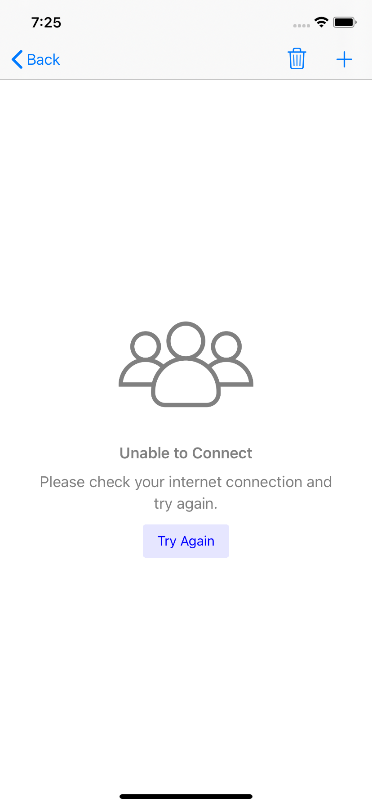
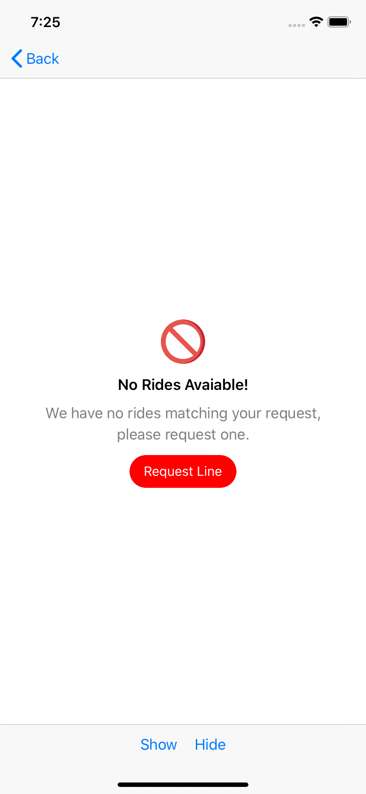
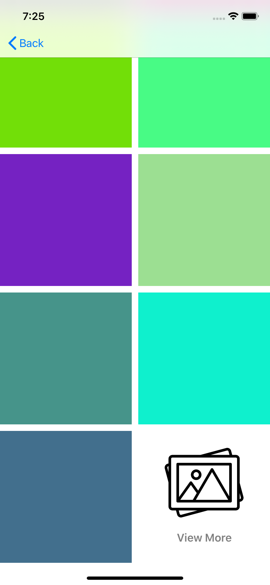
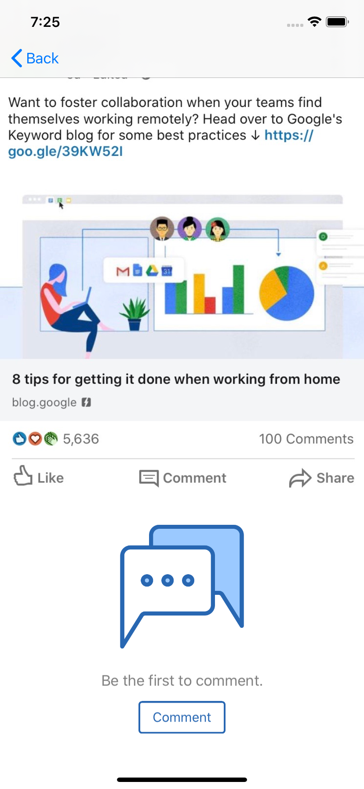
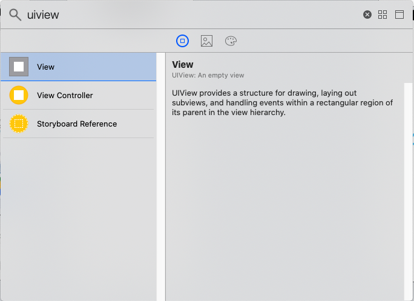
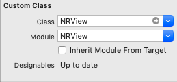
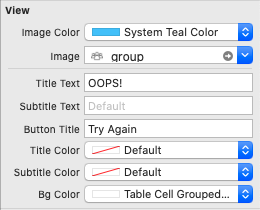

# NRView


[](https://cocoapods.org)

Today almost all apps have Api requests. Despite the fact that many of them fail dure to network issue or for any other reasons.`NRView` has been conceived to address this need, an elegant message to users with a minimal effort.

## Getting Started

These instructions will get you a copy of the project up and running on your local machine for development and testing purposes. See deployment for notes on how to deploy the project on a live system.

## Features

* Ability to show image, text, button or all of them.
* Add pre-customized attributes for the element.
* Handle button action if needed.

## Requirements

iOS 10.0+
Xcode 10.2+
Swift 5+

## Preview

<table>
<tr>
<td width="25%">
<center>Example 01</center>
</td>
<td width="25%">
<center>Example 02</center>
</td>
<td width="25%">
<center>UICollectionViewCell</center>
</td>
<td width="25%">
<center>UITableViewCell</center>
</td>
</tr>
<tr>
<td width="25%">
</img>
</td>
<td width="25%">
</img>
</td>
<td width="25%">
</img>
</td>
<td width="25%">
</img>
</td>
</tr>
</table>

## Installing

#### CocoaPods

CocoaPods is a dependency manager for Cocoa projects. For usage and installation instructions, visit their website. To integrate NRView into your Xcode project using CocoaPods, specify it in your Podfile:
```
pod 'NRView', '~> 0.2.0'
```

#### Manually

If you prefer not to use any of the aforementioned dependency managers, you can copy ``` Source ``` into your project manually.

## How It Works

#### Using Storyboard/ xib
1) Drag `View` object from the *Object Library* into your storyboard.



2) Set the view's class to `NRView` in the *Identity Inspector*.



3) Customize the `NRView` appearance in the *Attributes Inspector*. 



#### Programatically
Add `import NRView` to your source code.

Setup `NRViewSettings` object
```
  let settings: NRSettings = {
    var settings = NRSettings()
    
    // Set title label text
    settings.titleText = "Unable to Connect"
    
    // Set subtitle label text
    settings.subtitleText = "Please check your internet connection and try again."
    
    // Set image 
    settings.image = UIImage(named: "group")
    
    // Set image tint color
    settings.imageColor = .gray
    
    // Image width, types available are regular, compact or set any width  
    settings.imageWidthType = .compact
    
    // Set button configuration 
    var buttonSettings = NRButtonSettings()
    
    // Button title
    buttonSettings.title = "Try Again"
    
    // Button corner radius
    buttonSettings.cornerRadius = 3
    
    // Button background color
    buttonSettings.backgroundColor = UIColor.blue.withAlphaComponent(0.1)
    
    // Button text color
    buttonSettings.textColor = .blue
    
    // Button settings, set to nil to hide the button
    settings.buttonSettings = buttonSettings
    
    return settings
  }()
```

Initialize NRView with settings
```
  lazy var nrView: NRView = {
    let nrView = NRView.addToView(view, settings: settings)
    
    // Action when button tapped
    nrView.didTapButton = { button in
      print("Button Tapped...")
    }
    return nrView
  }()

```

Show & hide `NRView` with different animations types.
```
nrView.show(withAnimationType: .fade(0.5))
```
```
nrView.hide(withAnimationType: .none)
```

## Communication

* If you found a bug, open an issue here on GitHub and follow the guide. The more detail the better!
* If you want to contribute, submit a pull request.

## License

`NRView` is licensed under the [MIT license](https://github.com/ahmdmhasn/NRView/blob/master/LICENSE).  The icons are made by [Freepik](http://www.freepik.com) from [Flaticon](http://www.flaticon.com) and are licensed under [Creative Commons BY 3.0](http://creativecommons.org/licenses/by/3.0/).
